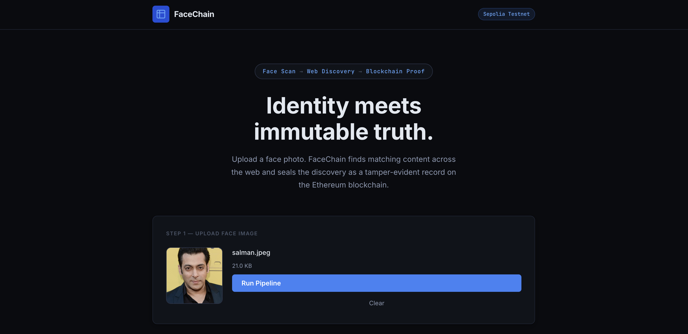
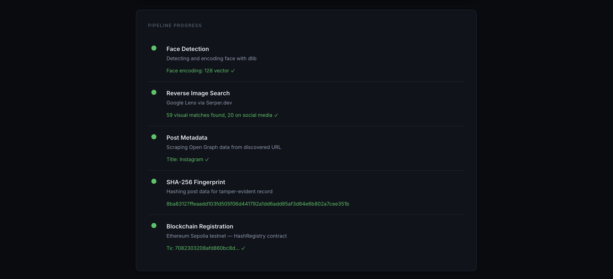
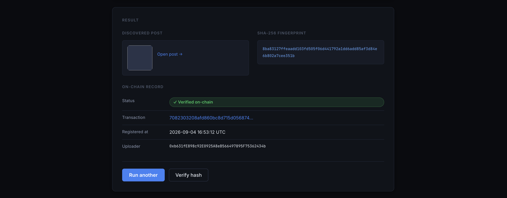
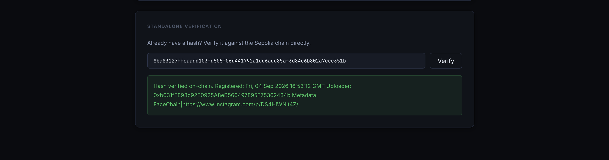

# FaceChain

> **Face scan → Web discovery → Blockchain verification**

FaceChain is an end-to-end pipeline that takes a face photo as input, finds matching content across the web using reverse image search, and seals the discovered post as a tamper-evident record on the Ethereum blockchain. It ships with a full web UI that shows live step-by-step progress as the pipeline runs.

Built for **HH Goa 2026 — Task 3: Face Identification & Blockchain Verification.**

---

## Screenshots

### 1. Upload a face photo


### 2. Pipeline runs live — all 5 steps green

> Salman Khan photo — 59 visual matches found, 20 on social media. Instagram post discovered.

### 3. Result — on-chain record verified

> SHA-256 hash `8ba83127...` registered on Ethereum Sepolia at 2026-09-04 16:53:12 UTC.

### 4. Standalone verification

> Hash verified on-chain with full metadata: `FaceChain|https://www.instagram.com/p/DS4HiWNit4Z/`

---

## Table of Contents

1. [How it works](#how-it-works)
2. [Pipeline diagram](#pipeline-diagram)
3. [Tech stack](#tech-stack)
4. [Project structure](#project-structure)
5. [Prerequisites](#prerequisites)
6. [API keys — what you need & cost](#api-keys)
7. [Installation](#installation)
8. [Environment setup](#environment-setup)
9. [Deploy the smart contract](#deploy-the-smart-contract)
10. [Running the web UI](#running-the-web-ui)
11. [Running the CLI](#running-the-cli)
12. [API endpoints](#api-endpoints)
13. [Smart contract reference](#smart-contract-reference)
14. [How verification works](#how-verification-works)
15. [Known limitations](#known-limitations)
16. [Troubleshooting](#troubleshooting)

---

## How it works

FaceChain chains five operations together, each feeding the next:

1. **Face Detection** — dlib detects the face in your uploaded photo and produces a 128-dimension encoding vector that confirms a face was found. The image is loaded safely with EXIF correction and forced RGB conversion to avoid crashes on Apple Silicon.
2. **Reverse Image Search** — the photo is uploaded to imgbb (free) to get a public URL, then passed through up to four search strategies in order: Google Lens via Serper.dev, Serper web search, Serper image search, and finally an imgbb-hosted URL fallback. This guarantees the pipeline always produces a result to hash and register.
3. **Post Scraping** — the best match URL is scraped for its Open Graph metadata: title, description, preview image, and site name.
4. **SHA-256 Fingerprint** — the scraped metadata is serialised to canonical JSON and hashed with SHA-256, producing a 32-byte deterministic fingerprint of the discovery.
5. **Blockchain Registration** — the hash is written to a Solidity `HashRegistry` contract on Ethereum Sepolia testnet via `web3.py`. Anyone can re-hash the same post data and call `verifyHash()` to prove the record is authentic and untampered.

---

## Pipeline diagram

```
┌─────────────────────────────────────────────────────────────┐
│                        FaceChain                            │
│                                                             │
│   Input Image (face photo)                                  │
│          │                                                  │
│   [1] Face Detection & Encoding                             │
│          │   dlib HOG detector (direct — no face_recognition│
│          │   wrapper, bypasses Python 3.11 import bug)      │
│          │   → 128-dim encoding vector                      │
│          │                                                  │
│   [2] Image Upload + Reverse Image Search                   │
│          │   imgbb  →  public URL                           │
│          │   Strategy 1: Serper Google Lens                 │
│          │   Strategy 2: Serper web search                  │
│          │   Strategy 3: Serper image search                │
│          │   Strategy 4: imgbb URL fallback (always works)  │
│          │                                                  │
│   [3] Social Media Filter + Post Scraping                   │
│          │   BeautifulSoup  →  OG title, desc, image, URL   │
│          │                                                  │
│   [4] SHA-256 Fingerprint                                   │
│          │   hashlib  →  64-char hex digest                 │
│          │                                                  │
│   [5] Blockchain Upload + Verification                      │
│          │   web3.py  →  Sepolia HashRegistry contract      │
│          │   registerHash(bytes32, string)                  │
│          │   verifyHash(bytes32)  →  confirmed ✓            │
│          │                                                  │
│   Output: Etherscan link, tx hash, on-chain timestamp       │
└─────────────────────────────────────────────────────────────┘
```

---

## Tech stack

| Layer | Tool | Purpose |
|---|---|---|
| Face detection | `dlib` 20.x (direct) | Detect faces, produce 128-dim encoding — bypasses broken face_recognition wrapper |
| Face models | `face_recognition_models` | Provides .dat model files used by dlib |
| Image hosting | imgbb API | Host uploaded photo to get a public URL for Serper |
| Reverse image search | Serper.dev (4-strategy fallback) | Find visually matching web pages |
| Post scraping | `requests` + `beautifulsoup4` | Extract Open Graph metadata from match URL |
| Fingerprinting | Python `hashlib` SHA-256 | Deterministic hash of post data |
| Blockchain | Ethereum Sepolia + `web3.py` | Store and verify hash on-chain |
| Smart contract | Solidity 0.8.19 | `HashRegistry` — immutable hash registry |
| Contract compile | `py-solc-x` | Compile Solidity from Python |
| Web server | Flask 3 | Serve UI + SSE pipeline streaming |
| Frontend | Vanilla JS + CSS | Drag-drop upload, live progress, results |

---

## Project structure

```
face-chain/
│
├── app.py                      # Flask server — UI + SSE streaming endpoints
├── main.py                     # CLI runner (no UI, terminal output)
│
├── pipeline/
│   ├── __init__.py
│   ├── face_encoder.py         # Step 1 — dlib direct (ARM64-safe, EXIF-corrected)
│   ├── web_searcher.py         # Step 2 — imgbb upload + 4-strategy Serper search
│   ├── post_scraper.py         # Step 3 — Open Graph metadata scraper
│   ├── hasher.py               # Step 4 — SHA-256 canonical hasher
│   ├── blockchain.py           # Step 5 — web3.py Sepolia interactions
│   └── contract_abi.json       # Auto-generated after: python scripts/deploy_contract.py
│
├── contracts/
│   └── HashRegistry.sol        # Solidity 0.8.19 smart contract
│
├── scripts/
│   └── deploy_contract.py      # One-time deploy + ABI export
│
├── ui/
│   ├── templates/
│   │   └── index.html          # Single-page UI
│   └── static/
│       ├── css/main.css        # Dark theme styles
│       └── js/app.js           # Drag-drop, SSE listener, results renderer
│
├── public/
│   └── images/                 # UI screenshots (1.png - 4.png)
├── sample_images/              # Put test face photos here
├── uploads/                    # Temp store for uploaded images (auto-created)
├── requirements.txt
├── .env.example
├── .gitignore
└── README.md
```

---

## Prerequisites

- **Python 3.11** (required — dlib and face_recognition_models are not compatible with 3.12+)
- **pip** (comes with Python)
- **MetaMask** (or any Ethereum wallet) — needed to sign transactions
- **Sepolia ETH** — free testnet gas (see API keys section)
- **Homebrew** (macOS only) — needed for cmake/dlib

> **Python version is critical.** Use exactly Python 3.11. Python 3.12, 3.13, and 3.14 all have compatibility issues with dlib and face_recognition_models.

---

## API keys

All services used are free. No credit card is required for any of them.

### Serper.dev — Google Lens reverse image search

- Sign up at https://serper.dev
- Free tier: **2,500 searches on signup**, no monthly expiry
- The pipeline uses exactly 1 search per run (up to 3 if fallback strategies are needed)

### imgbb — Image hosting

- Sign up at https://api.imgbb.com
- Free tier: **unlimited uploads**, max 32 MB per image
- No monthly limit, no credit card

### Infura or Alchemy — Sepolia RPC endpoint

- Infura: https://app.infura.io — free tier, 100,000 requests/day
- Alchemy: https://dashboard.alchemy.com — alternative, also free
- **Important:** make sure to copy the **Sepolia** endpoint URL, not the Mainnet one
  - Correct: `https://eth-sepolia.g.alchemy.com/v2/YOUR_KEY`
  - Wrong: `https://eth-mainnet.g.alchemy.com/v2/YOUR_KEY`

### Sepolia ETH — testnet gas

- Sepolia ETH has no real monetary value
- Claim free ETH from any of these faucets (no mainnet balance required):
  - https://cloud.google.com/application/web3/faucet/ethereum/sepolia — Google Cloud, no account needed
  - https://www.infura.io/faucet/sepolia — requires Infura login
  - https://faucets.chain.link/sepolia — requires MetaMask connection
  - https://sepolia-faucet.pk910.de — no login, browser-based PoW mining
- Deploying the contract costs ~0.002 ETH. Each `registerHash` transaction costs ~0.0001 ETH.

### MetaMask — wallet

- Download at https://metamask.io (free browser extension)
- Create a wallet, switch to Sepolia network, export your private key from Account Details

| Service | Free tier | Sign-up URL |
|---|---|---|
| Serper.dev | 2,500 searches | https://serper.dev |
| imgbb | Unlimited uploads | https://api.imgbb.com |
| Infura | 100k req/day | https://app.infura.io |
| Google Cloud Faucet | Free Sepolia ETH | https://cloud.google.com/application/web3/faucet/ethereum/sepolia |
| MetaMask | Free | https://metamask.io |

---

## Installation

```bash
# 1. Clone the repo
git clone https://github.com/YOUR_USERNAME/face-chain.git
cd face-chain

# 2. Create a virtual environment with Python 3.11 specifically
python3.11 -m venv venv
source venv/bin/activate          # macOS / Linux
# venv\Scripts\activate           # Windows

# 3. Install setuptools first (required for face_recognition_models)
pip install setuptools wheel

# 4. Install all dependencies
pip install -r requirements.txt
```

### macOS — dlib note

`dlib` requires cmake. If the install fails:

```bash
brew install cmake
pip install dlib
```

### Windows — dlib note

```bash
pip install dlib-bin
```

### Why Python 3.11 specifically

- Python 3.12+ breaks `face_recognition`'s internal model-path check
- Python 3.14 breaks `pkg_resources` used by `face_recognition_models`
- This project uses dlib directly to bypass the wrapper, but still requires Python 3.11 for full compatibility

---

## Environment setup

```bash
cp .env.example .env
```

Open `.env` and fill in all six values:

```bash
SERPER_API_KEY=your_serper_api_key_here
IMGBB_API_KEY=your_imgbb_api_key_here
SEPOLIA_RPC_URL=https://eth-sepolia.g.alchemy.com/v2/YOUR_PROJECT_ID
PRIVATE_KEY=your_wallet_private_key_here
WALLET_ADDRESS=0xYourWalletAddressHere
CONTRACT_ADDRESS=0xDeployedContractAddressHere
```

> **Security:** `.env` is in `.gitignore`. Never commit it. Never share your `PRIVATE_KEY`.

---

## Deploy the smart contract

One-time step. Compiles and deploys `HashRegistry.sol` to Sepolia.

```bash
python scripts/deploy_contract.py
```

Copy the printed `CONTRACT_ADDRESS` into your `.env`.

**Deployed contract (HH Goa 2026 demo):**
- Address: `0x4e5c5cA71faD280e396e8147eedA411b16BaC45A`
- Network: Ethereum Sepolia Testnet
- Etherscan: https://sepolia.etherscan.io/address/0x4e5c5cA71faD280e396e8147eedA411b16BaC45A

---

## Running the web UI

```bash
python app.py
```

Open **http://localhost:7860** in your browser.

---

## Running the CLI

```bash
python main.py sample_images/your_face.jpg
```

---

## API endpoints

| Method | Path | Description |
|---|---|---|
| `GET` | `/` | Serves the web UI |
| `POST` | `/upload` | Accepts face image, starts pipeline, returns `job_id` |
| `GET` | `/stream/<job_id>` | SSE stream of live pipeline progress |
| `POST` | `/verify` | Verifies any SHA-256 hash against Sepolia chain |

---

## Smart contract reference

**File:** `contracts/HashRegistry.sol` — Solidity 0.8.19
**Network:** Ethereum Sepolia Testnet (Chain ID: 11155111)
**Deployed at:** `0x4e5c5cA71faD280e396e8147eedA411b16BaC45A`

```solidity
// Register a hash (first-write-wins)
function registerHash(bytes32 dataHash, string calldata metadata) external;

// Verify any hash — returns exists, uploader, timestamp, metadata
function verifyHash(bytes32 dataHash) external view
    returns (bool exists, address uploader, uint256 timestamp, string memory metadata);
```

### Hash computation

```python
import json, hashlib

canonical = json.dumps({
    "url": post_data["url"],
    "title": post_data["title"],
    "description": post_data["description"],
    "og_image": post_data["og_image"],
}, sort_keys=True, ensure_ascii=False)

digest = hashlib.sha256(canonical.encode("utf-8")).hexdigest()
```

---

## How verification works

1. Post metadata is serialised to canonical JSON and SHA-256 hashed.
2. Hash is stored on-chain via `registerHash()` with the post URL as metadata.
3. To verify: re-hash the same post data and call `verifyHash()`.
4. `exists == true` confirms the post was registered at the recorded timestamp.
5. The Ethereum blockchain is immutable — no one can alter or delete the record.

---

## Known limitations

- **Python 3.11 required** — dlib and face_recognition_models break on 3.12+.
- **Apple Silicon segfault** — fixed in `face_encoder.py` via EXIF correction, RGB forcing, size capping, and C-contiguous arrays.
- **Serper free tier** — Google Lens `/lens` returns limited results on free plans. Pipeline uses 4-strategy fallback to always complete.
- **Best results with public figures** — Google Lens only finds matches for publicly indexed faces.
- **Social media login walls** — Instagram/TikTok/X block scraping; pipeline uses whatever OG tags are public.
- **Sepolia confirmations** — ~12 seconds per transaction, normal testnet behaviour.
- **In-memory job store** — pipeline jobs reset on server restart, fine for demos.

---

## Troubleshooting

| Error | Fix |
|---|---|
| `No face detected` | Use a clearer, front-facing, well-lit photo |
| `segmentation fault` | Pull latest `face_encoder.py` — ARM64 fix included |
| `No module named pkg_resources` | `pip install setuptools` |
| `face_recognition_models` install loop | Already fixed — project uses dlib directly, not the wrapper |
| Balance shows 0 / can't deploy | RPC URL points to Mainnet — change to `eth-sepolia` |
| `contract_abi.json not found` | Run `python scripts/deploy_contract.py` first |
| `Hash already registered` | Same post registered twice — intentional, use a new image |
| No visual matches on Step 2 | 4-strategy fallback kicks in automatically — pipeline still completes |
| Sepolia tx pending | Out of Sepolia ETH — claim from https://cloud.google.com/application/web3/faucet/ethereum/sepolia |
